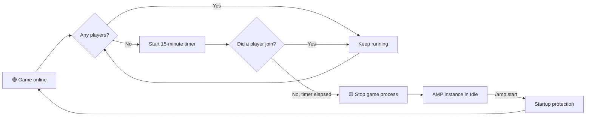

<div align="center">

**English** · [Português (Brasil)](README.md)

# 🎮 AmpControl

### Manage AMP game servers from Discord—with security, automation, and lower resource usage.

[](https://github.com/Carlos-Gabryel/ampcontrol/actions/workflows/ci.yml)
[](https://github.com/Carlos-Gabryel/ampcontrol/actions/workflows/security.yml)
[](https://go.dev/)
[](LICENSE)

AmpControl connects [CubeCoders AMP](https://cubecoders.com/AMP) to Discord. Communities can monitor and control game servers without receiving administrative-panel access, while hosts avoid keeping every game process running when nobody is playing.

</div>

---

## ✨ Features

| Feature | Purpose |
| --- | --- |
| 🖥️ **Interactive dashboards** | One card per server with state, game, address, CPU, memory, uptime, and player count. |
| 🎛️ **Discord controls** | Start, stop, restart, shut down, and update instances through buttons and `/amp`. |
| 💤 **Automatic Idle** | Stops an empty game process after the configured inactivity period. |
| 🛡️ **Active-game protection** | Prevents regular users from interrupting servers with active or unconfirmed players. |
| 🔎 **Player detection** | Prefers the AMP API and supports RCON fallbacks when a game needs a more reliable source. |
| 📦 **Automatic inventory** | Discovers instances through ADS with a local `ampinstmgr` fallback. |
| 🧾 **Audit trail** | Records the user, command, server, time, and outcome in a private channel. |
| 🩺 **Diagnostics** | Checks Discord, ADS, Idle, RCON detectors, and the pinned dashboard. |
| 🔐 **Separated administration** | Keeps `/amp` public while restricting `/ampconfig` to approved administrators. |
| 🔑 **Protected secrets** | Encrypts tokens and passwords with `systemd-creds`; secrets are not stored in TOML. |
| 🌐 **Portuguese or English** | The installer selects the language for commands, dashboards, logs, and maintenance tools. |

## 💤 Automatic Idle: the main differentiator

Running several game servers commonly means reserving CPU and memory even when every server is empty. AmpControl reduces this waste without shutting down AMP or removing the server from Discord.

When a registered instance remains empty for **15 minutes**—configurable per server—AmpControl:

1. checks the player count at regular intervals;
2. resets the timer whenever a player is found;
3. warns the Discord channel when the inactivity limit is reached;
4. stops only the game process;
5. keeps the AMP instance running in **Idle**, ready for `/amp start`.



This releases resources for active servers while keeping the instance manageable and visible. Startup remains manual through Discord.

> [!IMPORTANT]
> AmpControl is conservative. If the player count fails or is ambiguous, it does **not** place the server in Idle and blocks destructive commands from regular users. Keeping a process running is safer than interrupting an active game.

The AMP API is the primary telemetry source. Palworld and Project Zomboid can use authoritative RCON fallbacks. RCON passwords are also delivered as encrypted systemd credentials. New AMP instances appear automatically, but an administrator must explicitly register them for Idle.

## 💬 Discord experience

The selected channel contains a pinned user guide followed by one interactive card per visible server. Temporary messages expire automatically. Card accent colors represent:

| Color | State | Meaning |
| :---: | --- | --- |
| 🟢 | **Online** | The game process is running. |
| 🟡 | **Idle** | AMP is running, but the game process is stopped to save resources. |
| 🔴 | **Offline** | The AMP instance is shut down. |

Commands may be restricted to this channel. The AMP management link and `/ampconfig` remain administrative.

## 🚀 Quick installation

### Requirements

- Linux with systemd and `systemd-creds`;
- AMP installed on the same host;
- Git, Python 3, and `sudo` access;
- Go 1.26.6+ unless installing a release binary;
- a Discord application created by the administrator.

```bash
git clone https://github.com/Carlos-Gabryel/ampcontrol.git
cd ampcontrol
sudo ./scripts/install.sh
```

The first question selects **Português (Brasil)** or **English (United States)**. The assistant then discovers AMP, asks which instances should use Idle, collects Discord and AMP settings, encrypts secrets, validates the configuration, and starts the service.

Read the [complete installation guide](docs/INSTALLATION.en.md) before installing. It explains how to create the Discord bot, use a dedicated AMP account, collect IDs, and validate the deployment.

Official Linux `amd64` and `arm64` release packages include SHA-256 checksums:

```bash
sudo ./scripts/install.sh --language en-US --binary ./ampcontrol
```

## ⬆️ Updates and rollback

```bash
sudo ampcontrol-maintenance update
sudo ampcontrol-maintenance status
sudo ampcontrol-maintenance rollback
```

The updater verifies the release checksum, validates the current configuration with the staged binary, and creates a backup before replacement. Startup failure triggers automatic rollback. Legacy `/opt/ampcontrol` installations have a [transactional migration procedure](docs/INSTALLATION.en.md#8-migrate-a-legacy-installation).

## ⌨️ Commands

### All users

| Command | Action |
| --- | --- |
| `/amp status` | Refreshes the pinned dashboard. |
| `/amp start` | Starts the AMP instance and game process. |
| `/amp stop` | Stops the game process and keeps the instance Idle. |
| `/amp restart` | Restarts the game process when no active game is detected. |
| `/amp shutdown` | Completely shuts down the instance after confirmation and player checks. |
| `/amp update` | Updates the instance after confirmation and player checks. |

### Administrators

`/ampconfig` provides diagnostics, card customization, visibility control, and Idle registration. Access is checked against the configured owner and role IDs.

| Command | Action |
| --- | --- |
| `/ampconfig diagnostics` | Checks integration health. |
| `/ampconfig configure` | Sets display name, game, address, maximum players, and detector. |
| `/ampconfig hide` / `show` | Controls whether an instance appears in Discord. |
| `/ampconfig idle-add` | Registers an instance for automatic Idle. |

See the [configuration reference](docs/CONFIGURATION.en.md).

## 🧱 Current scope

| Supported now | Planned |
| --- | --- |
| Linux with systemd | Windows |
| One local AMP installation | Remote AMP |
| One Discord server per bot | Multiple Discord servers |
| Interactive installer and releases | Native distribution packages |

## 🔒 Security

- Discord, AMP, and RCON secrets are encrypted for the host with `systemd-creds`;
- a dedicated service user and restricted sudo wrapper provide least privilege;
- regular users cannot interrupt confirmed active games;
- administrative commands and audit records are separated from the public interface.

Read the [security policy](SECURITY.en.md) and [architecture](docs/ARCHITECTURE.en.md). Remove tokens, passwords, internal addresses, and personal IDs before sharing logs.

## 🛠️ Development

```bash
go test ./...
go vet ./...
bash scripts/test-packaging.sh
```

See [Contributing](CONTRIBUTING.en.md). Pull requests run race-enabled tests, `go vet`, ShellCheck, packaging tests, `govulncheck`, and CodeQL.

## 📄 License and trademarks

Code is available under the [MIT license](LICENSE). AMP, Discord, Steam, and game names belong to their respective owners. Third-party logos are not relicensed under MIT; see the [third-party notices](THIRD_PARTY_NOTICES.en.md).
