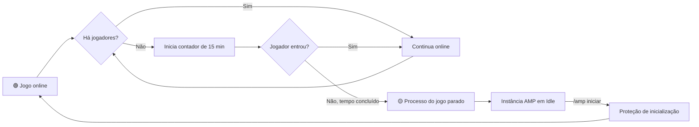

<div align="center">

[English](README.en.md) · **Português (Brasil)**

# 🎮 AmpControl

### Gerencie seus servidores AMP pelo Discord — com segurança, automação e economia de recursos.

[](https://github.com/Carlos-Gabryel/ampcontrol/actions/workflows/ci.yml)
[](https://github.com/Carlos-Gabryel/ampcontrol/actions/workflows/security.yml)
[](https://go.dev/)
[](LICENSE)

O AmpControl conecta o [AMP, da CubeCoders](https://cubecoders.com/AMP), ao Discord. A comunidade acompanha e controla os servidores de jogos sem receber acesso ao painel administrativo — e máquinas com vários jogos não precisam manter todos os processos consumindo recursos o tempo inteiro.

</div>

---

## ✨ O que o AmpControl oferece

| Recurso | O que ele faz |
| --- | --- |
| 🖥️ **Painéis interativos** | Exibe um cartão por servidor com estado, jogo, endereço, CPU, memória, tempo online e jogadores. |
| 🎛️ **Controle pelo Discord** | Permite iniciar, parar, reiniciar, desligar e atualizar instâncias usando botões e comandos `/amp`. |
| 💤 **Idle automático** | Encerra o processo do jogo quando o servidor fica vazio pelo período configurado. |
| 🛡️ **Proteção de partidas** | Impede que usuários comuns interrompam servidores com jogadores ativos ou contagem incerta. |
| 🔎 **Detecção de jogadores** | Prioriza a API do AMP e aceita fallback RCON para jogos que precisam de uma fonte mais confiável. |
| 📦 **Inventário automático** | Descobre as instâncias pelo ADS, com fallback local pelo `ampinstmgr`. |
| 🧾 **Auditoria** | Registra usuário, comando, servidor, horário e resultado em um canal privado. |
| 🩺 **Diagnóstico** | Verifica Discord, API ADS, motor de Idle, detectores RCON e painel fixo. |
| 🔐 **Administração separada** | Mantém `/amp` público e reserva `/ampconfig` ao proprietário e aos cargos autorizados. |
| 🔑 **Segredos protegidos** | Criptografa token e senhas com `systemd-creds`, sem gravá-los no TOML ou no repositório. |

## 💤 Idle automático: o diferencial do AmpControl

Hospedar vários jogos costuma significar manter processos consumindo CPU e memória mesmo quando ninguém está jogando. O Idle automático reduz esse desperdício sem desligar o AMP nem remover o servidor do Discord.

Quando uma instância cadastrada fica **15 minutos sem jogadores** — valor configurável por servidor — o AmpControl:

1. consulta a quantidade de jogadores em intervalos regulares;
2. reinicia o contador sempre que encontra alguém conectado;
3. avisa no Discord quando o limite de inatividade é atingido;
4. encerra somente o processo do jogo;
5. mantém a instância AMP ligada em estado **Idle**, pronta para ser iniciada novamente com `/amp iniciar`.



### Como isso economiza recursos

- o processo pesado do jogo deixa de reservar CPU e memória quando o servidor está vazio;
- outros servidores ativos passam a ter mais recursos disponíveis;
- a instância continua administrável pelo AMP e visível no painel do Discord;
- o usuário volta a jogar iniciando manualmente o servidor pelo próprio Discord.

> [!IMPORTANT]
> O AmpControl age de forma conservadora. Se a contagem de jogadores falhar ou for ambígua, ele **não coloca o servidor em Idle** e bloqueia comandos destrutivos de usuários comuns. É preferível manter um processo ligado a interromper uma partida.

### API do AMP e fallback RCON

A fonte principal é a telemetria da API do AMP. Quando ela não fornece uma contagem confiável, a instância pode usar um detector RCON específico, atualmente disponível para Palworld e Project Zomboid. Senhas RCON também são entregues ao serviço como credenciais criptografadas.

Novas instâncias aparecem automaticamente no painel, mas não entram no Idle sem autorização. Um administrador decide isso com `/ampconfig idle-adicionar`.

## 💬 Experiência no Discord

O canal configurado fica organizado em duas partes fixas:

1. um guia de comandos para os usuários;
2. cartões atualizados de cada servidor visível.

Mensagens transitórias são removidas após o tempo configurado. Cada cartão oferece ações compatíveis com o estado atual e mostra a lateral em verde, amarelo ou vermelho:

| Cor | Estado | Significado |
| :---: | --- | --- |
| 🟢 | **Online** | Processo do jogo em execução. |
| 🟡 | **Idle** | Instância ligada, mas processo do jogo parado para economizar recursos. |
| 🔴 | **Offline** | Instância AMP desligada. |

Os comandos podem ser restritos a um único canal. O botão administrativo que abre a instância no AMP e os comandos `/ampconfig` ficam disponíveis somente para quem foi autorizado.

## 🚀 Instalação rápida

### Requisitos

- Linux com systemd e `systemd-creds`;
- AMP instalado na mesma máquina;
- Git, Python 3 e acesso `sudo`;
- Go 1.26.6 ou superior, salvo ao instalar um binário de release;
- aplicação Discord criada pelo próprio administrador.

```bash
git clone https://github.com/Carlos-Gabryel/ampcontrol.git
cd ampcontrol
sudo ./scripts/install.sh
```

O assistente de instalação:

1. pergunta se toda a instalação deve usar português ou inglês;
2. localiza o AMP, o `ampinstmgr`, o usuário do sistema e as instâncias existentes;
3. pergunta quais instâncias devem usar Idle automático;
4. solicita token do bot, servidor Discord, canais, proprietário e cargos administrativos;
5. permite restringir todos os comandos ao canal escolhido;
6. configura acesso à API do AMP, endereços e detectores;
7. mostra um resumo antes de alterar o sistema;
8. cria o serviço, as permissões mínimas e as credenciais criptografadas;
9. valida a configuração e inicia o AmpControl.

> [!TIP]
> Antes de instalar, siga o [guia completo de instalação](docs/INSTALLATION.md). Ele explica como criar o bot Discord, a conta dedicada no AMP e copiar cada ID necessário.

Releases oficiais incluem pacotes Linux `amd64` e `arm64` com checksums SHA-256. Depois de extrair um pacote:

```bash
sudo ./scripts/install.sh --binary ./ampcontrol
```

## ⬆️ Atualizações e rollback

Uma instalação configurada pode receber a versão estável mais recente com:

```bash
sudo ampcontrol-maintenance update
```

O atualizador confere o checksum, valida a configuração usando o novo binário e cria um backup antes da troca. Se o serviço não iniciar, o rollback é automático.

```bash
sudo ampcontrol-maintenance status
sudo ampcontrol-maintenance rollback
```

Instalações antigas em `/opt/ampcontrol` possuem uma [migração transacional documentada](docs/INSTALLATION.md#8-migrar-uma-instalação-antiga), com pré-validação somente leitura e restauração automática em caso de falha.

## ⌨️ Comandos

### Para todos os usuários

| Comando | Ação |
| --- | --- |
| `/amp status` | Atualiza o painel fixo. |
| `/amp iniciar` | Inicia a instância e o processo do jogo. |
| `/amp parar` | Para o jogo e mantém a instância em Idle. |
| `/amp reiniciar` | Reinicia o processo do jogo, se não houver partida ativa. |
| `/amp desligar` | Desliga completamente a instância após confirmação e verificação de jogadores. |
| `/amp atualizar` | Atualiza a instância após confirmação e verificação de jogadores. |

### Para administradores

`/ampconfig` oferece diagnóstico, personalização dos cartões, controle de visibilidade e cadastro no Idle. O acesso é validado pelo ID do proprietário e pelos cargos explicitamente configurados.

| Comando | Ação |
| --- | --- |
| `/ampconfig diagnostico` | Verifica a saúde de todas as integrações. |
| `/ampconfig configurar` | Personaliza nome, jogo, endereço, máximo de jogadores e detector. |
| `/ampconfig ocultar` / `exibir` | Controla a presença de uma instância no Discord. |
| `/ampconfig idle-adicionar` | Cadastra uma instância no Idle automático. |

A referência completa está no [guia de configuração](docs/CONFIGURATION.md).

## 🧱 Escopo do projeto

| Suportado agora | Planejado |
| --- | --- |
| Linux com systemd | Windows |
| Uma instalação AMP local | AMP remoto |
| Um servidor Discord por bot | Múltiplos servidores Discord |
| Instalador interativo e releases | Pacotes nativos por distribuição |

## 🔒 Segurança

- token Discord, senha AMP e senhas RCON não ficam no TOML;
- credenciais são criptografadas para o host com `systemd-creds`;
- o serviço usa usuário dedicado e um wrapper limitado às operações permitidas;
- usuários comuns não conseguem interromper partidas em andamento;
- comandos administrativos e auditoria ficam separados da interface pública.

Leia a [política de segurança](SECURITY.md) e a [arquitetura](docs/ARCHITECTURE.md). Antes de publicar logs, remova tokens, senhas, endereços privados e identificadores pessoais.

## 🛠️ Desenvolvimento

```bash
go test ./...
go vet ./...
```

Testes que dependem de uma instalação AMP real são opt-in:

```bash
go test -tags=integration ./...
```

Veja [Como contribuir](CONTRIBUTING.md). Cada pull request executa testes com detector de corrida, `go vet`, ShellCheck, testes de empacotamento, `govulncheck` e CodeQL. Em repositórios privados sem GitHub Advanced Security, o SARIF fica disponível como artefato; em repositórios públicos, os resultados são enviados automaticamente ao Code scanning.

## 📄 Licença e marcas

O código é disponibilizado sob a [licença MIT](LICENSE). AMP, Discord, Steam e os jogos mencionados pertencem aos respectivos titulares. Logos e recursos de terceiros não são relicenciados pela MIT; consulte os [avisos de terceiros](THIRD_PARTY_NOTICES.md).
