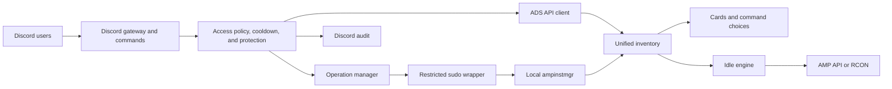

# Architecture

**English** · [Português (Brasil)](ARCHITECTURE.md)

## Components

- `cmd/ampcontrol`: entry point;
- `internal/config` and `internal/secret`: TOML, legacy compatibility, and systemd credentials;
- `internal/i18n`: installation-wide language catalog;
- `internal/amp`: ADS authentication, inventory, and AMP operations;
- `internal/discord`: commands, cards, access policy, audit, and diagnostics;
- `internal/idle`: player counts, RCON, and Idle transitions;
- `internal/operation`: serialization and locking of concurrent operations;
- `scripts/install.sh`: transactional interactive Linux installation.

## Inventory

ADS is preferred. If it is temporarily unavailable, local `ampinstmgr` inventory keeps known instances accessible. Dashboard, commands, and Idle consume the same inventory to avoid divergent lists. New instances appear automatically in Discord, but Idle registration requires an explicit administrative decision.

## Trust boundaries

- Discord authenticates the user; AmpControl still validates channel, owner, and roles;
- the AMP account should use least privilege;
- the process does not execute `ampinstmgr` directly as root, using a validated wrapper and restricted sudoers policy;
- secrets reach the process through temporary systemd credential files;
- inconclusive player counts block destructive actions from regular users.

## Persistent state

Declarative configuration and secrets belong to the system administrator. Preferences, pinned-message IDs, and timers belong to the service user. None of these files should be committed.
