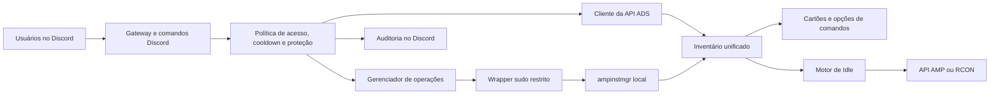

# Arquitetura

## Componentes

- `cmd/ampcontrol`: ponto de entrada;
- `internal/config` e `internal/secret`: TOML, compatibilidade legada e credenciais systemd;
- `internal/amp`: autenticação ADS, inventário e operações AMP;
- `internal/discord`: comandos, cartões, política de acesso, auditoria e diagnóstico;
- `internal/idle`: contagem de jogadores, RCON e transições para Idle;
- `internal/operation`: serialização e bloqueio de operações concorrentes;
- `scripts/install.sh`: instalação Linux transacional e interativa.

## Inventário

A API ADS é a fonte preferencial. Se ela estiver temporariamente indisponível, o inventário local do `ampinstmgr` mantém as instâncias conhecidas acessíveis. O mesmo inventário alimenta painel, comandos e Idle para evitar listas divergentes.

Novas instâncias aparecem automaticamente no Discord, mas o ingresso no Idle exige uma decisão administrativa explícita.

## Limites de confiança

- o Discord autentica o usuário, mas o AmpControl valida canal, proprietário e cargos;
- a conta AMP deve ter privilégios mínimos;
- o processo não executa `ampinstmgr` diretamente como root: usa um wrapper validado e sudoers restrito;
- segredos chegam ao processo por arquivos de credenciais temporários do systemd;
- uma contagem de jogadores inconclusiva bloqueia ações destrutivas para usuários comuns.

## Estado persistente

Configuração declarativa e segredos pertencem ao administrador do sistema. Preferências, IDs das mensagens fixas e cronômetros pertencem ao usuário do serviço. Nenhum desses arquivos deve ser versionado.
